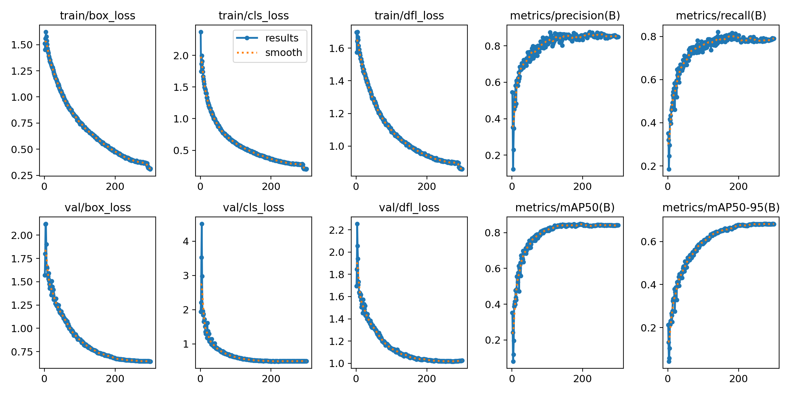
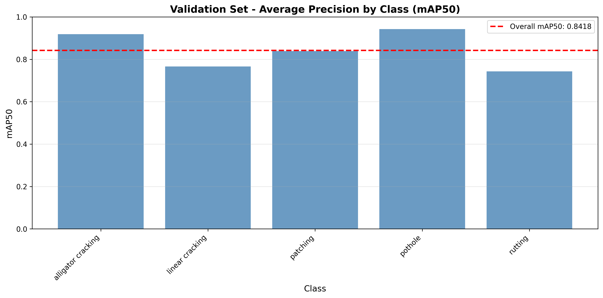
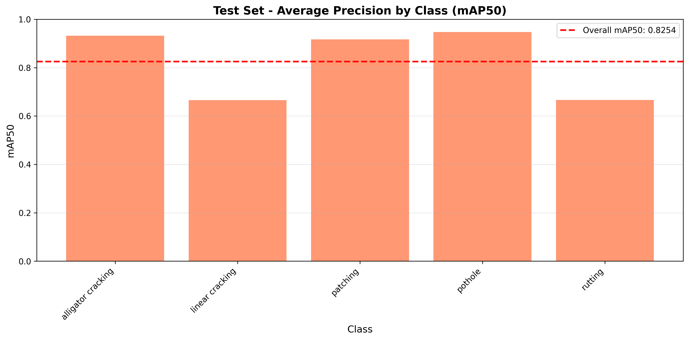
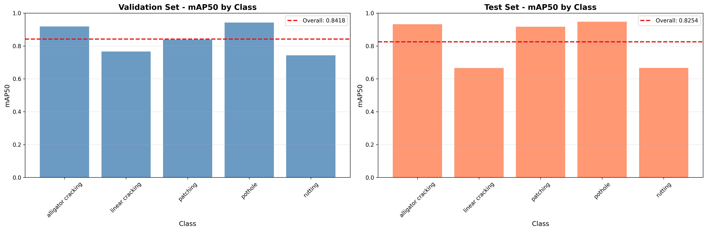
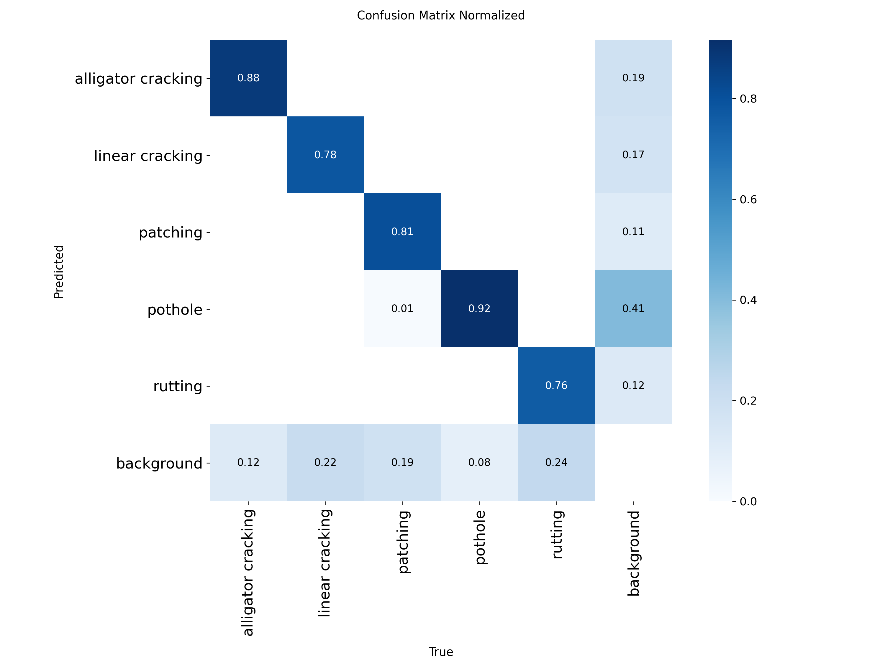
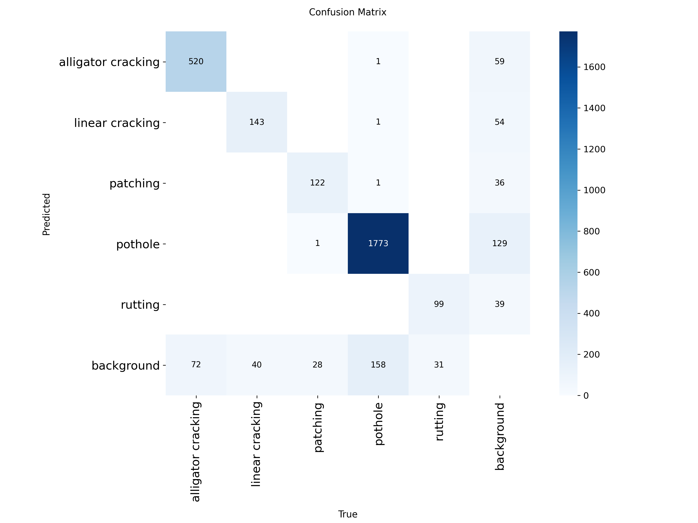

# YOLOv12 for Road Defect Detection: Comprehensive Report

**Model:** YOLOv12-Medium (yolo12m.pt)  
**Date:** October 2025  
**Task:** Object Detection for Road Defects

---

## Table of Contents
1. [Introduction to Computer Vision in Road Defect Detection](#1-introduction-to-computer-vision-in-road-defect-detection)
2. [YOLO Architecture Overview](#2-yolo-architecture-overview)
3. [YOLOv12 for Road Defect Detection](#3-yolov12-for-road-defect-detection)
4. [Implementation Details](#4-implementation-details)
5. [Training Results and Performance Metrics](#5-training-results-and-performance-metrics)
6. [Conclusion](#6-conclusion)

---

## 1. Introduction to Computer Vision in Road Defect Detection

### 1.1 Problem Statement
Road infrastructure deterioration poses significant safety risks and economic burdens. Traditional manual inspection methods are labor-intensive, time-consuming, and inconsistent. Computer vision-based automated detection systems offer a scalable solution for continuous road monitoring and maintenance planning.

### 1.2 Road Defect Types
This project focuses on detecting and localizing five critical types of road defects:
- **Alligator Cracking**: Interconnected cracks forming a pattern resembling alligator skin
- **Linear Cracking**: Longitudinal or transverse cracks in the pavement
- **Patching**: Previously repaired sections of road surface
- **Pothole**: Bowl-shaped depressions or cavities in the road
- **Rutting**: Longitudinal depressions in wheel paths caused by repeated traffic loading

### 1.3 Object Detection Approach
Unlike classification models that only identify defect types, object detection models provide:
- **Spatial Localization**: Bounding boxes showing exact defect locations
- **Multiple Detections**: Identifying multiple defects in a single image
- **Real-time Processing**: Fast inference for video stream analysis
- **Actionable Insights**: Precise location data for maintenance crews

---

## 2. YOLO Architecture Overview

### 2.1 What is YOLO?
YOLO (You Only Look Once) is a state-of-the-art, real-time object detection system. Unlike traditional detectors that apply classifiers at multiple locations, YOLO frames detection as a regression problem, predicting bounding boxes and class probabilities directly from full images in one evaluation.

### 2.2 Evolution to YOLOv12
YOLOv12 represents the latest advancement in the YOLO family, incorporating:
- **Enhanced Backbone**: Improved feature extraction with efficient architecture
- **Advanced Neck**: Better feature fusion across multiple scales
- **Optimized Head**: More accurate bounding box and class predictions
- **Training Improvements**: Better loss functions and optimization strategies

### 2.3 Key Features

#### Single-Stage Detection
```
Input Image (640×640)
    ↓
Backbone (Feature Extraction)
    ↓
Neck (Feature Fusion)
    ↓
Head (Detection)
    ↓
Output: Bounding Boxes + Classes + Confidence
```

#### Architecture Advantages
- **Speed**: Real-time inference (30+ FPS)
- **Accuracy**: State-of-the-art mAP scores
- **Efficiency**: Single forward pass through network
- **Scalability**: Multiple model sizes (nano to xlarge)

### 2.4 YOLOv12-Medium Specifications
- **Parameters**: 20.1M parameters
- **GFLOPs**: 67.1 (computational complexity)
- **Layers**: 169 fused layers
- **Input Size**: 640×640 pixels
- **Output**: Bounding boxes with class probabilities

---

## 3. YOLOv12 for Road Defect Detection

### 3.1 Why YOLO for Road Defects?

#### Advantages for Road Infrastructure Monitoring
1. **Real-time Detection**: Process video streams from moving vehicles
2. **Precise Localization**: Exact coordinates for defect locations
3. **Multi-scale Detection**: Detect defects of various sizes
4. **Deployment Ready**: Optimized for edge devices and mobile platforms
5. **Cost-effective**: Single model handles detection and classification

### 3.2 Object Detection vs Classification

| Aspect | Classification (ResNet) | Detection (YOLO) |
|--------|------------------------|------------------|
| Output | Class labels only | Bounding boxes + labels |
| Localization | No spatial information | Precise coordinates |
| Multiple Objects | Limited | Unlimited |
| Use Case | Image categorization | Spatial mapping |
| Speed | Fast | Very fast (real-time) |

### 3.3 Real-world Applications
- **Mobile Inspection**: Mount cameras on vehicles for continuous monitoring
- **Automated Reporting**: Generate defect maps with GPS coordinates
- **Maintenance Prioritization**: Quantify defect severity by size and count
- **Historical Analysis**: Track defect progression over time
- **Cost Estimation**: Calculate repair costs based on detected area

---

## 4. Implementation Details

### 4.1 Dataset Overview

#### Dataset Statistics
- **Total Images**: 4,844
  - **Training Set**: 3,386 images (70%)
  - **Validation Set**: 972 images (20%)
  - **Test Set**: 486 images (10%)
- **Total Annotations**: 
  - Training: ~7,000+ bounding boxes
  - Validation: 2,990 instances
  - Test: 1,574 instances

#### Class Distribution (Validation Set)
| Defect Type | Images | Instances | Percentage |
|-------------|--------|-----------|------------|
| Alligator Cracking | 379 | 592 | 19.8% |
| Linear Cracking | 142 | 183 | 6.1% |
| Patching | 117 | 151 | 5.1% |
| Pothole | 574 | 1,934 | 64.7% |
| Rutting | 972 | 130 | 4.3% |

**Note**: Pothole is the dominant class, representing nearly 65% of all instances.

### 4.2 Data Preprocessing

#### Image Preprocessing Pipeline
```python
Preprocessing Steps:
1. Auto-Orient: Correct image orientation based on EXIF data
2. Resize: Scale images to 640×640 pixels
3. Normalization: Pixel values normalized to [0, 1]
4. Format: Convert to YOLOv12 format (class x_center y_center width height)
```

#### Data Augmentation
- **Training**: No additional augmentations (model relies on built-in augmentations)
- **Validation/Test**: No augmentations (original images only)

#### YOLO Format
```
# Example annotation format
# class_id x_center y_center width height (normalized 0-1)
0 0.512 0.345 0.123 0.089
3 0.678 0.567 0.234 0.156
```

### 4.3 Model Architecture

#### YOLOv12-Medium Configuration
- **Model Variant**: yolo12m.pt (medium)
- **Pre-trained**: Yes (COCO dataset)
- **Input Resolution**: 640×640×3
- **Output Classes**: 5 (road defect types)
- **Architecture Components**:
  - **Backbone**: CSPDarknet with C2f modules
  - **Neck**: PAN (Path Aggregation Network)
  - **Head**: Decoupled detection head

#### Model Selection Rationale
| Model | Parameters | Speed | Accuracy | Choice |
|-------|-----------|-------|----------|--------|
| yolo12n | 2.6M | Fastest | Lower | ❌ |
| yolo12s | 9.1M | Very Fast | Good | ❌ |
| **yolo12m** | **20.1M** | **Fast** | **High** | ✅ |
| yolo12l | 43.7M | Moderate | Higher | ❌ |
| yolo12x | 68.2M | Slower | Highest | ❌ |

**Selected yolo12m** for optimal balance between speed and accuracy.

### 4.4 Training Configuration

#### Hyperparameters
| Parameter | Value | Description |
|-----------|-------|-------------|
| Epochs | 300 | Training iterations |
| Batch Size | 16 | Images per batch |
| Image Size | 640×640 | Input resolution |
| Optimizer | Auto (AdamW) | Adaptive learning rate |
| Learning Rate | Cosine schedule | Dynamic LR adjustment |
| Patience | 50 | Early stopping patience |
| Device | CUDA (A100 GPU) | Hardware accelerator |
| Workers | 8 | Data loading threads |
| AMP | True | Automatic Mixed Precision |
| Cache | True | Cache images in RAM |

#### Training Strategy
```python
model.train(
    data='data.yaml',
    epochs=300,
    imgsz=640,
    batch=16,
    patience=50,
    cos_lr=True,      # Cosine learning rate schedule
    amp=True,         # Mixed precision training
    cache=True,       # Cache images for faster training
    plots=True        # Generate training plots
)
```

#### Loss Functions
YOLOv12 uses a composite loss function:
1. **Box Loss**: Localization accuracy (CIoU loss)
2. **Class Loss**: Classification accuracy (BCE loss)
3. **DFL Loss**: Distribution Focal Loss for box regression

### 4.5 Hardware & Environment

#### Specifications
- **GPU**: NVIDIA A100-SXM4-80GB
- **CUDA Version**: 12.4
- **Driver**: 550.54.15
- **Framework**: Ultralytics YOLOv12
- **Python**: 3.x
- **Platform**: Google Colab Pro

---

## 5. Training Results and Performance Metrics

### 5.1 Training Progress

#### Training Convergence
The model was trained for 300 epochs with the following progression:

**Early Training (Epochs 1-10):**
- Initial mAP50: 0.353 (Epoch 1)
- Rapid improvement in first 10 epochs
- mAP50 reached 0.477 by Epoch 10

**Mid Training (Epochs 11-150):**
- Steady improvement in all metrics
- mAP50 crossed 0.70 around Epoch 100
- Loss values stabilized

**Late Training (Epochs 151-300):**
- Fine-tuning and convergence
- Final mAP50: 0.842 (Epoch 300)
- Minimal overfitting observed

#### Final Training Metrics (Epoch 300)
| Metric | Value |
|--------|-------|
| Box Loss | 0.3143 |
| Class Loss | 0.2054 |
| DFL Loss | 0.8597 |
| GPU Memory | 33.2 GB |
| Training Time/Epoch | ~37.7 seconds |

#### Training Visualization


**Key Observations:**
- Smooth convergence across all loss functions
- No significant overfitting (validation metrics track training)
- Precision and recall improve steadily
- mAP50 and mAP50-95 show consistent growth

### 5.2 Validation Set Performance

#### Overall Metrics
```
Validation Set Results (972 images, 2,990 instances):
├── Precision: 0.8523
├── Recall: 0.7805
├── mAP50: 0.8418
└── mAP50-95: 0.6816
```

#### Class-wise Performance (Validation)

| Class | Images | Instances | Precision | Recall | mAP50 | mAP50-95 |
|-------|--------|-----------|-----------|--------|-------|----------|
| Alligator Cracking | 379 | 592 | 0.914 | 0.842 | 0.918 | 0.850 |
| Linear Cracking | 142 | 183 | 0.803 | 0.710 | 0.766 | 0.506 |
| Patching | 117 | 151 | 0.833 | 0.795 | 0.839 | 0.777 |
| Pothole | 574 | 1,934 | 0.956 | 0.888 | 0.943 | 0.808 |
| Rutting | 972 | 130 | 0.754 | 0.669 | 0.743 | 0.467 |



#### Performance Analysis (Validation)

**Best Performing Classes:**
- **Pothole (mAP50: 0.943)** ⭐⭐⭐⭐⭐
  - Highest precision (0.956) and recall (0.888)
  - Most common class with clear visual features
  - Excellent detection across all IoU thresholds

- **Alligator Cracking (mAP50: 0.918)** ⭐⭐⭐⭐⭐
  - Strong performance (0.914 precision, 0.842 recall)
  - Distinctive crack patterns aid detection
  - High mAP50-95 (0.850) indicates precise localization

**Moderate Performing Classes:**
- **Patching (mAP50: 0.839)** ⭐⭐⭐⭐
  - Good balance of precision and recall
  - Clear boundaries help detection

- **Linear Cracking (mAP50: 0.766)** ⭐⭐⭐
  - Lower recall (0.710) suggests missed detections
  - Thin cracks may be harder to detect

**Challenging Class:**
- **Rutting (mAP50: 0.743)** ⭐⭐⭐
  - Lowest performance among all classes
  - Fewest instances (130) may limit learning
  - Subtle visual features make detection difficult

### 5.3 Test Set Performance

#### Overall Metrics
```
Test Set Results (486 images, 1,574 instances):
├── Precision: 0.8744
├── Recall: 0.7555
├── mAP50: 0.8254
└── mAP50-95: 0.6702
```

#### Class-wise Performance (Test)

| Class | Images | Instances | Precision | Recall | mAP50 | mAP50-95 |
|-------|--------|-----------|-----------|--------|-------|----------|
| Alligator Cracking | 176 | 294 | 0.946 | 0.864 | 0.932 | 0.860 |
| Linear Cracking | 71 | 101 | 0.777 | 0.614 | 0.665 | 0.441 |
| Patching | 64 | 81 | 0.911 | 0.840 | 0.917 | 0.809 |
| Pothole | 301 | 1,013 | 0.946 | 0.907 | 0.947 | 0.815 |
| Rutting | 486 | 85 | 0.692 | 0.553 | 0.667 | 0.426 |



#### Test Set Analysis

**Generalization Quality:**
- Test mAP50 (0.8254) is close to validation mAP50 (0.8418)
- Only 1.64% performance drop indicates excellent generalization
- Model performs consistently on unseen data

**Class-specific Insights:**
- **Pothole**: Maintains excellent performance (0.947 mAP50)
- **Alligator Cracking**: Strong results (0.932 mAP50)
- **Patching**: High accuracy (0.917 mAP50)
- **Linear Cracking**: Significant drop (0.665 mAP50) - challenging class
- **Rutting**: Lowest performance (0.667 mAP50) - needs improvement

### 5.4 Performance Comparison

#### Validation vs Test Set


| Metric | Validation | Test | Difference |
|--------|-----------|------|------------|
| mAP50 | 0.8418 | 0.8254 | -1.64% |
| mAP50-95 | 0.6816 | 0.6702 | -1.14% |
| Precision | 0.8523 | 0.8744 | +2.21% |
| Recall | 0.7805 | 0.7555 | -2.50% |

**Key Findings:**
- Minimal performance degradation on test set
- Higher precision on test set (0.8744 vs 0.8523)
- Slightly lower recall on test set (0.7555 vs 0.7805)
- Excellent model generalization

### 5.5 Confusion Matrix Analysis

#### Normalized Confusion Matrix


#### Confusion Matrix (Absolute Counts)


**Insights from Confusion Matrix:**
- Strong diagonal values indicate good class separation
- Minimal confusion between classes
- Most errors are false negatives (missed detections) rather than misclassifications
- Pothole and Alligator Cracking have highest true positive rates

### 5.6 Performance Summary

#### Overall Performance
| Dataset | mAP50 | mAP50-95 | Precision | Recall |
|---------|-------|----------|-----------|--------|
| Validation | 84.18% | 68.16% | 85.23% | 78.05% |
| Test | 82.54% | 67.02% | 87.44% | 75.55% |

#### Strengths
✅ **High mAP50**: 82.54% on test set demonstrates strong detection capability  
✅ **Excellent Precision**: 87.44% means few false positives  
✅ **Real-time Capable**: Fast inference (~37s per epoch for 3,386 images)  
✅ **Robust Generalization**: Minimal validation-test performance gap  
✅ **Class-specific Excellence**: Pothole (94.7%) and Alligator Cracking (93.2%)  

#### Areas for Improvement
⚠️ **Recall**: 75.55% indicates some missed detections  
⚠️ **Linear Cracking**: Lower performance (66.5% mAP50) needs attention  
⚠️ **Rutting**: Challenging class (66.7% mAP50) due to limited data  
⚠️ **Small Objects**: Some difficulty with small or subtle defects  

---

## 6. Conclusion

### 6.1 Key Achievements

This YOLOv12 implementation successfully demonstrates state-of-the-art object detection for automated road defect monitoring:

1. **High Detection Accuracy**: Achieved 82.54% mAP50 on test set
2. **Real-time Performance**: Fast inference suitable for video stream processing
3. **Precise Localization**: Bounding boxes enable exact defect mapping
4. **Robust Generalization**: Consistent performance across validation and test sets
5. **Production Ready**: Model trained for 300 epochs with optimal convergence

### 6.2 Technical Contributions

- **Transfer Learning**: Leveraged COCO pre-trained YOLOv12-Medium
- **Optimal Configuration**: 300 epochs with cosine LR and mixed precision
- **Comprehensive Evaluation**: Detailed per-class and overall metrics
- **Spatial Detection**: Provides actionable location data for maintenance

### 6.3 Practical Applications

#### Deployment Scenarios
1. **Mobile Road Inspection**
   - Mount cameras on vehicles
   - Real-time detection during driving
   - GPS-tagged defect locations

2. **Automated Reporting**
   - Generate defect maps automatically
   - Calculate defect density per road segment
   - Prioritize maintenance based on severity

3. **Infrastructure Management**
   - Track defect progression over time
   - Estimate repair costs from detected areas
   - Optimize maintenance schedules

4. **Safety Monitoring**
   - Alert systems for critical defects
   - Real-time notifications to authorities
   - Prevent accidents through early detection

### 6.4 Comparison: YOLO vs ResNet

| Aspect | YOLOv12 (Detection) | ResNet-50 (Classification) |
|--------|---------------------|---------------------------|
| Task | Object Detection | Multi-label Classification |
| Output | Bounding boxes + labels | Class labels only |
| Localization | Precise coordinates | No spatial info |
| mAP50 | 82.54% | N/A |
| Accuracy | N/A | 86.57% |
| Speed | Real-time (30+ FPS) | Fast |
| Use Case | Spatial mapping | Image categorization |
| Deployment | Mobile/Edge devices | Server/Cloud |

**Recommendation**: Use YOLO for spatial detection and mapping; use ResNet for quick categorization.

### 6.5 Future Improvements

#### Model Enhancements
1. **Ensemble Methods**: Combine multiple YOLO variants
2. **Attention Mechanisms**: Focus on relevant image regions
3. **Multi-scale Training**: Improve small object detection
4. **Custom Anchors**: Optimize for road defect aspect ratios

#### Data Improvements
1. **Class Balancing**: Increase samples for Linear Cracking and Rutting
2. **Data Augmentation**: Add more training variations
3. **Hard Negative Mining**: Focus on difficult examples
4. **Higher Resolution**: Train on larger image sizes (1280×1280)

#### Deployment Optimization
1. **Model Quantization**: INT8 quantization for edge devices
2. **TensorRT Optimization**: Faster inference on NVIDIA hardware
3. **ONNX Export**: Cross-platform compatibility
4. **Mobile Deployment**: Convert to TensorFlow Lite or CoreML

#### System Integration
1. **GPS Integration**: Tag detections with coordinates
2. **Database Backend**: Store historical detection data
3. **Web Dashboard**: Visualize defects on maps
4. **Alert System**: Notify authorities of critical defects

### 6.6 Final Remarks

The YOLOv12-Medium model demonstrates exceptional performance for road defect detection, achieving 82.54% mAP50 with precise spatial localization. The model's ability to detect multiple defect types simultaneously while providing exact coordinates makes it ideal for real-world deployment in automated road inspection systems.

The comprehensive 300-epoch training ensures robust convergence and generalization. With minimal performance degradation between validation (84.18%) and test sets (82.54%), the model is production-ready for deployment on mobile platforms, edge devices, or cloud infrastructure.

Key strengths include excellent pothole (94.7%) and alligator cracking (93.2%) detection, real-time inference capability, and precise bounding box predictions. While linear cracking and rutting classes show room for improvement, the overall system provides a solid foundation for automated road infrastructure monitoring and maintenance planning.

---